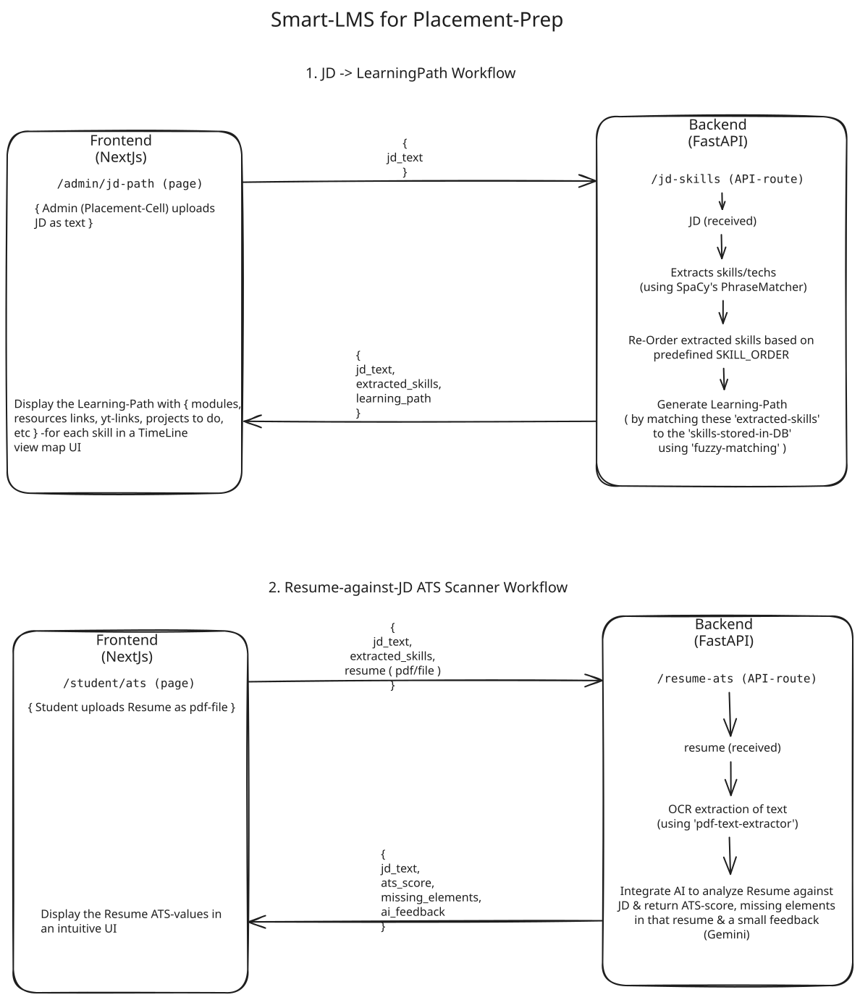

# cse-hackathon-snist
A temp-repo of FastAPI server for SNIST-CSE hackathon

## Features / API's
- `/` -> health test endpoint
- `/jd-skills` -> JD -to- Learning-Path Generation
- `/ats-resume` -> Resume-upload -to- ATS score & Missing skills & a short AI-Feedback

## Folder Structure
    fastapi-server/
    │
    ├── app/
    │   ├── main.py          # Entry point of the app
    │   ├── routes.py      # Contains all Routes & uses `services/` for business logic
    │   ├── utils.py         # utils like RateLimiter
    │   └── services/      ### Business Logic of APIs
    │       ├── db.py        # Contains DB logic
    │       ├── jd.py      # Logic for JD -> Learning Path Generation
    │       └── ats.py       # Logic of ATS-Scanner of Resumes
    │
    ├── requirements.txt     # Contains all deps to install
    └── README.md

## 🔁 Workflows

  <h2><a href="https://raw.githubusercontent.com/srinivas-batthula/cse-hackathon-snist/refs/heads/main/assets/snist_cse_hackathon_fastapi_img.svg" target="_blank">All features Workflow</a></h2>
  
  <a href="https://raw.githubusercontent.com/srinivas-batthula/cse-hackathon-snist/refs/heads/main/assets/snist_cse_hackathon_fastapi.excalidraw">You can also <strong>import</strong> this file into <strong>Excalidraw</strong></a>

  

